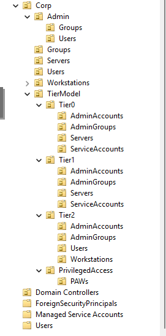
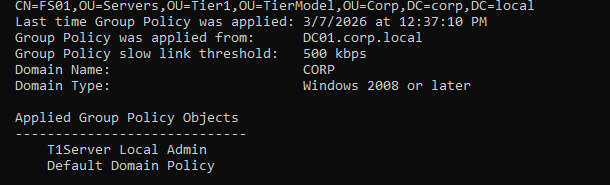
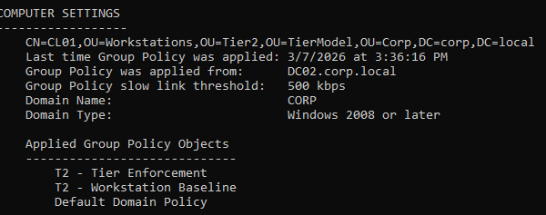
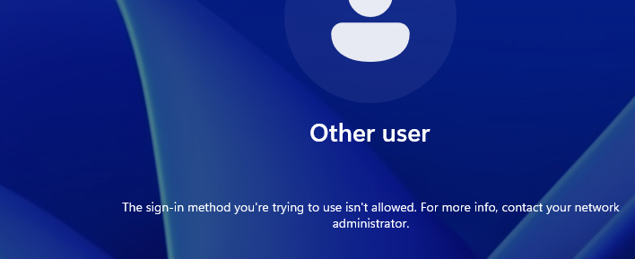
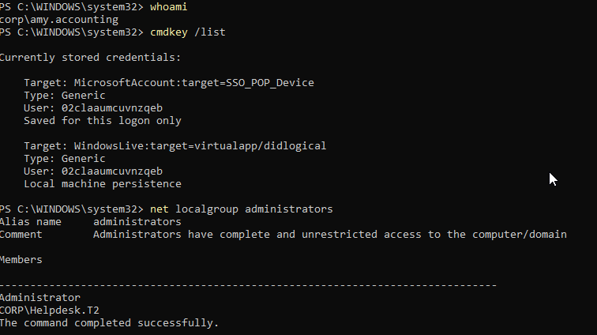

# 04.3 – Tier Model Implementation

## Objective

Implement an **enterprise-style Active Directory tier model** to prevent credential exposure and lateral movement.

This lab demonstrates:

* Tiered administrative architecture
* OU boundary design
* Group Policy enforcement
* Logon restriction validation
* Credential exposure verification

The goal is to prevent privileged credentials from appearing on lower-tier systems where attackers could steal them.

---

# Environment

Domain:

```
corp.local
```

## Domain Controllers

```
DC01 – Windows Server Core
DC02 – Windows Server (GUI)
```

Services running:

```
Active Directory Domain Services
DNS
Kerberos KDC
Global Catalog
```

## Servers

```
FS01 – File Server
```

Purpose:

```
Simulate Tier1 infrastructure server
Host NTFS resource permissions
```

## Workstations

```
CL01 – Windows 11
```

Purpose:

```
User logons
Credential exposure testing
GPO validation
```

## Privileged Access Workstation

```
PAW01
```

Used for:

```
Tier0 administrative activity
Domain administration
Active Directory management
```

---

# Tier Architecture

Active Directory environments should separate administrative identities into security tiers.

```
Tier0 → Identity Infrastructure
Tier1 → Server Infrastructure
Tier2 → User Workstations
```

Credential exposure rule:

```
Tier0 credentials must never appear on Tier1 or Tier2 systems
Tier1 credentials must never appear on Tier2 systems
```

This prevents attacks such as:

```
Pass-the-Hash
Credential dumping
Kerberos ticket theft
Domain takeover
```

---

# OU Architecture

A new OU structure was created to enforce administrative boundaries.

```
corp.local
│
└── Corp
    │
    └── TierModel
        │
        ├── Tier0
        │   ├── AdminAccounts
        │   ├── AdminGroups
        │   ├── Servers
        │   └── ServiceAccounts
        │
        ├── Tier1
        │   ├── AdminAccounts
        │   ├── AdminGroups
        │   ├── Servers
        │   └── ServiceAccounts
        │
        ├── Tier2
        │   ├── AdminAccounts
        │   ├── AdminGroups
        │   ├── Users
        │   └── Workstations
        │
        └── PrivilegedAccess
            └── PAWs
```

### OU Structure in Active Directory



---

# Administrative Identity Mapping

Administrative accounts were separated by tier.

## Tier0

```
T0Admin
GG_T0_Admins
```

Responsibilities:

```
Active Directory
Domain controllers
Group policy governance
```

---

## Tier1

```
T1Admin
GG_T1_Server_Admins
```

Responsibilities:

```
Server administration
Infrastructure services
File servers
```

---

## Tier2

```
Helpdesk.T2
GG_T2_Helpdesk
GG_T2_Workstation_Admins
```

Responsibilities:

```
Workstation administration
User support
Desktop troubleshooting
```

---

# System Placement

Systems were moved into their appropriate tier containers.

## Tier1 Servers

```
FS01
```

OU:

```
TierModel → Tier1 → Servers
```

---

## Tier2 Workstations

```
CL01
```

OU:

```
TierModel → Tier2 → Workstations
```

---

## Privileged Access Workstation

```
PAW01
```

OU:

```
TierModel → PrivilegedAccess → PAWs
```

---

# Group Policy Enforcement

Group Policy is used to enforce administrative boundaries.

## Tier1 Server Policy

GPO:

```
T1Server Local Admin
```

Purpose:

```
Define authorized server administrators
Prevent workstation administrators from server access
```

### Server Policy Verification

Command executed on **FS01**:

```
gpresult /r
```

Result:



Applied policies:

```
T1Server Local Admin
Default Domain Policy
```

---

## Tier2 Workstation Policies

GPOs:

```
T2 - Tier Enforcement
T2 - Workstation Baseline
```

Purpose:

```
Apply workstation security configuration
Restrict privileged logons
```

### Workstation Policy Verification

Command executed on **CL01**:

```
gpresult /r
```

Result:



Applied policies:

```
T2 - Tier Enforcement
T2 - Workstation Baseline
Default Domain Policy
```

---

# Logon Restriction Test

To validate credential isolation, a privileged account attempted to log into a lower-tier workstation.

Attempted login:

```
T0Admin → CL01
```

Expected result:

```
Access denied
```

### Logon Blocked by Policy



Error:

```
The sign-in method you're trying to use isn't allowed.
```

This confirms:

```
Tier0 credentials cannot authenticate to Tier2 machines
```

---

# Credential Exposure Verification

To confirm no privileged credentials existed on the compromised workstation, several inspection commands were executed.

## Current User

```
whoami
```

Result:

```
corp\amy.accounting
```

---

## Cached Credentials

```
cmdkey /list
```

Result:



No privileged credentials were present.

---

## Local Administrators

```
net localgroup administrators
```

Result:

```
Administrator
CORP\Helpdesk.T2
```

Domain administrators are **not present** on the workstation.

---

## Logged-in Sessions

```
query user
```

Result:

```
amy.accounting
```

No privileged sessions were active.

---

# Security Outcome

The implemented tier model successfully prevents privileged credential exposure.

Without tiering:

```
Administrator logs into workstation
↓
Attacker compromises workstation
↓
Credentials extracted from LSASS
↓
Domain compromise
```

With tiering:

```
Privileged login blocked
↓
No credentials present
↓
Attacker cannot escalate privileges
```

---

# Conclusion

This lab demonstrates the implementation of an **enterprise Active Directory tier security model**.

Key protections implemented:

```
Administrative tier separation
OU boundary enforcement
Group Policy logon restrictions
Credential exposure validation
```

The environment now mirrors security practices recommended by Microsoft for protecting Active Directory environments from credential-theft attacks.

