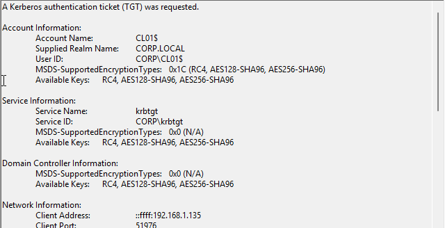
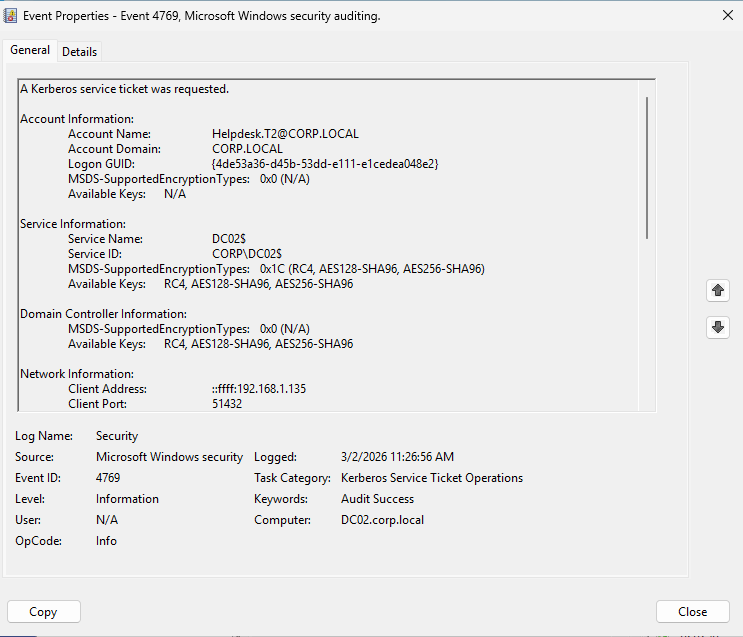

# 06.1 – Kerberos & Logon Event Correlation

## 🎯 Objective

Validate Advanced Audit Policy configuration by tracing a full authentication chain from a domain workstation (CL01) to a Domain Controller (DC02).

This confirms:

- Kerberos auditing is functional
- Tier enforcement is intact
- Logon telemetry is visible
- Privileged session detection is possible

---

# 🧪 Test Scenario

User: `Helpdesk.T2`  
Client: `CL01` (192.168.1.135)  
Domain Controller: `DC02`

User logged out of CL01 and logged back in to generate clean authentication events.

---

# 🔐 Event Trace Sequence

## 1️⃣ Event ID 4768 – Kerberos TGT Issued

**Time:** 11:26:24 AM  
**Account Name:** Helpdesk.T2  
**Client Address:** 192.168.1.135  
**Ticket Encryption Type:** 0x12 (AES256)

Meaning:

> Domain Controller issued a Ticket Granting Ticket (TGT) to Helpdesk.T2.

This confirms Kerberos Authentication Service auditing is working.

---

## 2️⃣ Event ID 4769 – Kerberos Service Ticket Requested

**Time:** 11:26:56 AM  
**Account Name:** Helpdesk.T2  
**Service Name:** DC02$  
**Client Address:** 192.168.1.135  

Meaning:

> The user used their TGT to request a service ticket for a service hosted on DC02.

This commonly occurs for:
- LDAP queries
- SYSVOL access
- Group Policy processing

---

## 3️⃣ Event ID 4624 – Logon Created

**Logon Type:** 3 (Network Logon)  
**Source Address:** 192.168.1.135  

Meaning:

> DC02 validated a network authentication request from CL01.

Important distinction:

- Logon Type 3 = Network logon
- This does NOT indicate console access to the DC
- It represents authentication validation

---

## 4️⃣ Event ID 4672 – Special Privileges Assigned (If Applicable)

This event appears when:

> The logon session contains administrative privileges.

This validates detection of privileged sessions.

---

# 🧠 Identity Flow Summary

Authentication sequence observed:

CL01
↓
4768 – TGT issued
↓
4769 – Service ticket requested
↓
4624 – Network logon session created
↓
4672 – Privileged session (if admin)

This demonstrates full Kerberos + logon telemetry visibility.

---

# 🛡 Governance Validation

This test confirms:

✔ Advanced Audit Policy is functioning  
✔ Kerberos auditing is enabled  
✔ Client IP tracking is visible  
✔ Encryption strength (AES256) confirmed  
✔ Tier enforcement intact  
✔ No interactive DC logon from Tier 2  

---

# 🔎 Detection Engineering Insight

From a security monitoring perspective:

- 4768 reveals initial authentication
- 4769 reveals service access
- 4624 reveals logon type and source IP
- 4672 reveals privilege elevation

Correlating these events enables:

- Lateral movement detection
- Suspicious privileged logon detection
- Kerberos abuse monitoring
- Tier boundary violation detection

---

# 🏗 Lab Maturity Level

The lab now includes:

- Multi-DC replication
- FSMO awareness
- krbtgt auditing
- Tier model enforcement
- Advanced audit telemetry
- Privileged session visibility

Environment status:

Active Directory is not only deployed — it is governed and observable.

---

## 📸 Evidence – Kerberos Authentication Chain

### 🔐 Event ID 4768 – TGT Issed (Computer Account)

This event shows the workstation computer account (CL01$) requesting a Ticket Granting Ticket from the Domain Controller.

Key Observations:

- Account Name: CL01$
- Service: krbtgt
- Encryption: AES256 (0x1C / AES128 / AES256 available)
- Client Address: 192.168.1.135
- Demonstrates machine authentication during logon

---

### 🎫 Event ID 4769 – Service Ticket Request (User)

This event shows Helpdesk.T2 requesting a Kerberos service ticket after receiving a TGT.

Key Observations:

- Account Name: Helpdesk.T2
- Service Name: DC02$
- Client Address: 192.168.1.135
- Occurs after TGT issuance
- Confirms Kerberos ticket usage for domain services

---

## 🔎 What This Demonstrates

These screenshots validate:

✔ Kerberos Authentication Service auditing  
✔ Kerberos Service Ticket auditing  
✔ Machine account authentication visibility  
✔ User authentication visibility  
✔ Client IP traceability  
✔ AES encryption usage  

---

## 🧠 Enterprise Relevance

Understanding these events enables:

- Detection of abnormal Kerberos patterns
- Identification of lateral movement
- Monitoring of privileged authentication
- Detection of ticket abuse scenarios (Golden Ticket / Pass-the-Ticket)
- Tier boundary violation analysis

This confirms the lab environment is not only secured but observable at protocol level.

