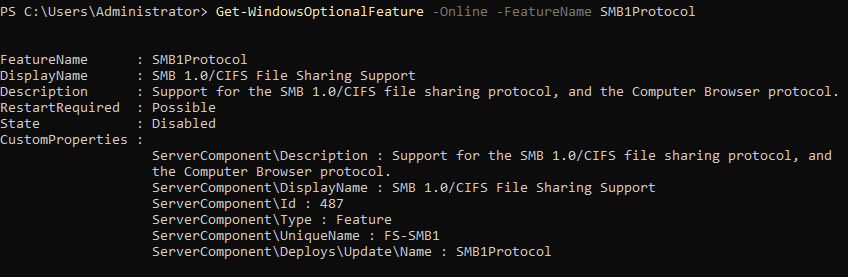
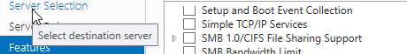

# Phase 7 – Legacy Protocol Hardening

## SMBv1 Verification

SMBv1 was verified to be disabled on all critical systems in the lab environment.

---

## DC01 (PowerShell Verification)

Command executed:

Get-WindowsOptionalFeature -Online -FeatureName SMB1Protocol

Result:

FeatureName : SMB1Protocol
DisplayName : SMB 1.0/CIFS File Sharing Support
State : Disabled

Evidence:

This confirms the SMB 1.0 protocol feature is installed but **disabled**, preventing the system from accepting SMBv1 connections.

---

## FS01 (GUI Verification)

SMBv1 status was verified through the graphical interface.

Navigation path:
Server Manager
→ Manage
→ Add Roles and Features
→ Features

The feature **SMB 1.0/CIFS File Sharing Support** was confirmed to be **unchecked**, indicating SMBv1 is not enabled.

Evidence:

---

## Additional Server-Level Verification

To confirm the SMB server itself is not accepting SMBv1 connections, the following command can also be used:
Get-SmbServerConfiguration | Select EnableSMB1Protocol

Expected result:
EnableSMB1Protocol : False

---

## Security Impact

SMBv1 is a deprecated protocol that has been associated with multiple critical security vulnerabilities, including the **EternalBlue exploit** used during the WannaCry ransomware attack.

Disabling SMBv1 provides the following security benefits:

- Removes legacy file-sharing protocol attack surface
- Prevents exploitation of SMBv1-specific vulnerabilities
- Enforces modern SMB versions (SMBv2 / SMBv3)
- Aligns the environment with Microsoft security best practices

---

## Lab Outcome

SMBv1 has been verified as **disabled** across the following systems:

- **DC01 – Domain Controller**
- **FS01 – File Server**

This confirms the lab environment is not exposed to SMBv1-based attack vectors and meets modern security baseline recommendations.

