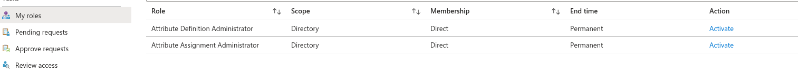
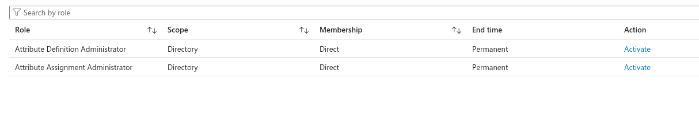
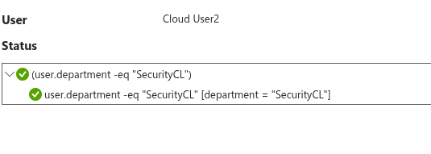
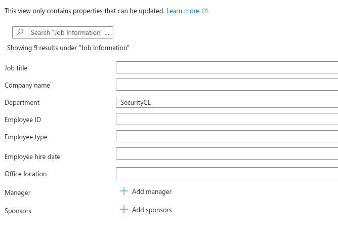
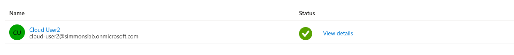
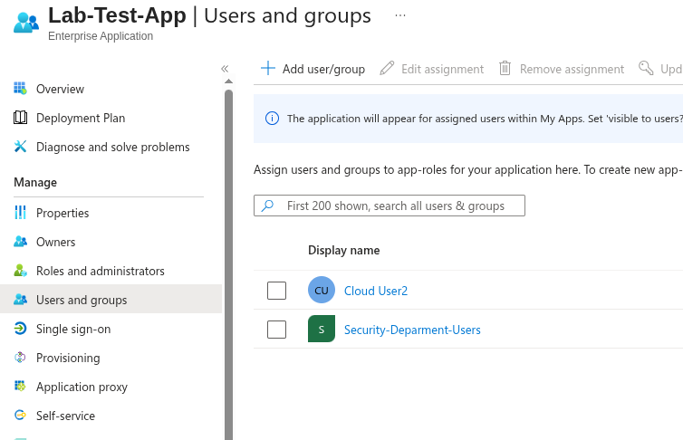
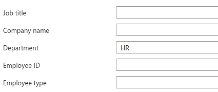
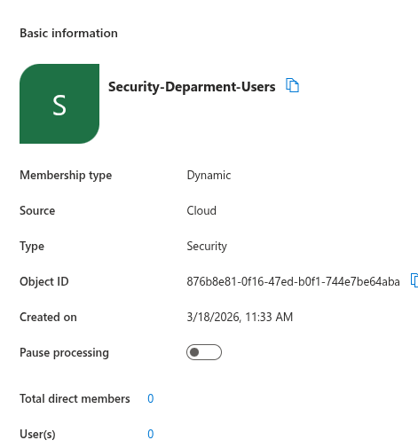

# 08.11 — Attribute-Based Access Control (ABAC)

## 🎯 Objective

Implement attribute-driven access automation in Microsoft Entra ID using:

* Custom Security Attributes (governed identity metadata)
* Dynamic Group Membership (automated access control)
* Enterprise Application assignment

---

## 🧠 Architecture

```text
User.department = SecurityCL
        ↓
Dynamic Group Membership
        ↓
Security-Department-Users
        ↓
Lab-Test-App Access
```

---

## 🧩 Part 1 — Custom Security Attributes

### Attribute Design

* **Attribute Set:** `SecurityCL`
* **Attribute Name:** `ClearanceLevel`
* **Value Assigned:** `High`



---

### Controlled Assignment (JIT + Separation of Duties)

Attribute assignment required:

* `Attribute Definition Administrator`
* `Attribute Assignment Administrator`

Both roles activated via **PIM (JIT)**.



---

## ⚠️ Platform Limitation

Attempted design:

```text
ClearanceLevel = High → Dynamic Group → Access
```

❌ Not supported in Entra dynamic groups

**Reason:**
Custom Security Attributes are not exposed to the dynamic membership engine.

---

## 🧩 Part 2 — Attribute-Driven Access (Supported Path)

### Dynamic Group

* **Name:** `Security-Department-Users`
* **Type:** Dynamic User

**Rule:**

```text
(user.department -eq "SecurityCL")
```



---

### User Attribute

```text
Department = SecurityCL
```



---

### Rule Validation



---

## 🔐 Application Assignment

Group assigned to:

```text
Lab-Test-App
```



---

## 🧪 Test — Provisioning

```text
Department = SecurityCL
        ↓
User added to group
        ↓
Access granted automatically
```

---

## 🧪 Test — Deprovisioning

Changed:

```text
SecurityCL → HR
```

Result:

```text
User removed from group
        ↓
Access removed automatically
```





---

## 🧠 Key Concepts Demonstrated

* Attribute-driven access control
* Dynamic group automation
* Just-In-Time privilege elevation
* Separation of duties
* Automated provisioning & deprovisioning

---

## 🧠 Takeaway

Access is no longer manually assigned.

It is:

```text
Driven by identity attributes
Evaluated automatically
Enforced without admin intervention
```

---

## 💬 Interview Talking Point

> Implemented attribute-driven access control in Microsoft Entra ID using dynamic group membership tied to user attributes, combined with governed custom security attributes and JIT role activation for secure assignment.

