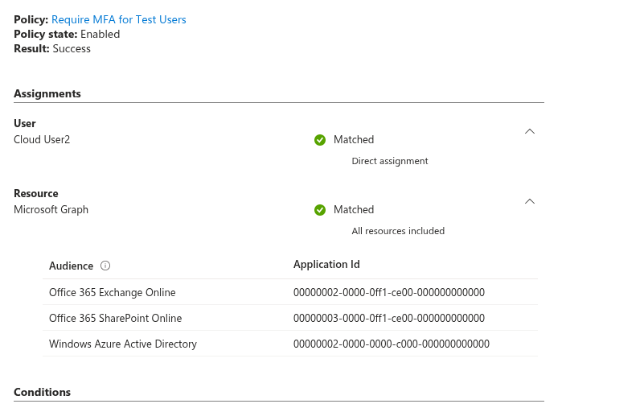
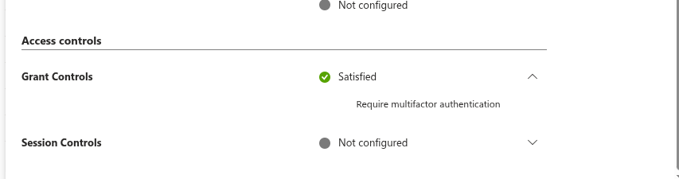
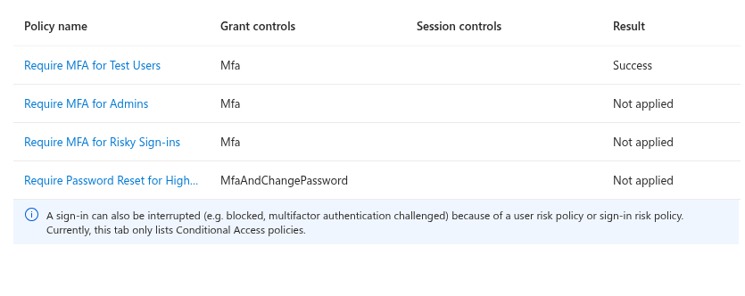

## 🧱 Phase 08.13 — Sign-in Logs & Conditional Access Validation

### 🎯 Objective
Analyze authentication events and verify that Conditional Access policies are applied and enforced during user sign-in.

---

### 🔍 Observations

- User: CloudUser2
- Application: OneDrive
- Status: Success

---

### 🔐 Conditional Access Evaluation

- Policy: Require MFA for Test Users
- Policy State: Enabled
- Result: Success

- Assignments:
  - User: CloudUser2 → Matched
  - Resource: Microsoft Graph → Matched

- Grant Controls:
  - Require multi-factor authentication → Satisfied

---

### 🧪 Sign-in Flow Analysis

User sign-in flow:

Username entered
↓
Password entered
↓
Conditional Access policy evaluated
↓
MFA required due to Conditional Access enforcement
↓
Microsoft Authenticator push notification
↓
Number matching + biometric verification completed
↓
Access granted

---

### 📸 Screenshots

---

### 🧠 Key Learning

Sign-in logs provide visibility into authentication activity and Conditional Access evaluation.  
They allow verification that policies are correctly applied and that required controls (such as MFA) are enforced.

---

### 🔥 Real-World Insight

Authentication configuration alone does not guarantee security.  
Sign-in telemetry is required to validate that policies are functioning as intended and enforcing access controls during real user activity.
