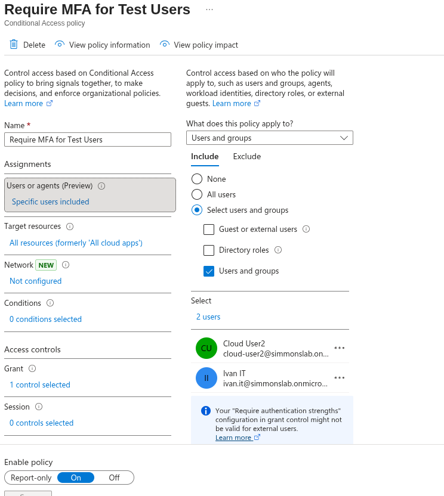
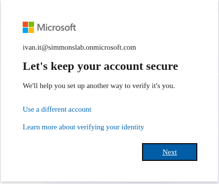
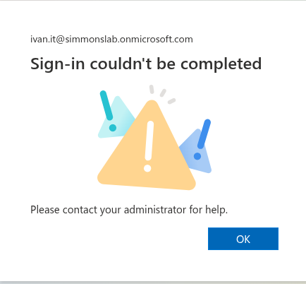
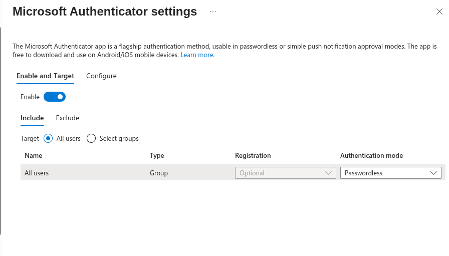
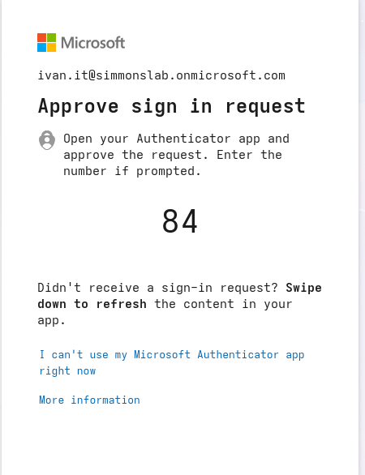
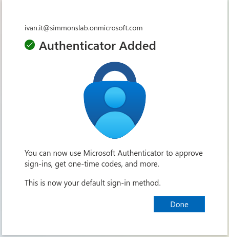

## 🧱 Phase 09.1 — Hybrid User Login & MFA Enrollment Troubleshooting

### 🎯 Objective
Validate cloud sign-in for a synced hybrid user and troubleshoot MFA enrollment and passwordless sign-in behavior in Microsoft Entra ID.

---

### 🔧 Scenario

After synchronizing on-prem Active Directory users into Microsoft Entra ID, I tested login using a hybrid user:

`ivan.it@simmonslab.onmicrosoft.com`

The goal was to:

- Confirm cloud authentication for a synced AD user  
- Apply MFA enforcement using Conditional Access  
- Register Microsoft Authenticator  
- Explore passwordless authentication behavior  

---

### 🧪 Step 1 — Hybrid User Sign-In

Logged in using:

`ivan.it@simmonslab.onmicrosoft.com`

### 🧠 Observed Behavior

- Password prompt displayed  
- Login successful  
- No MFA required initially  

This confirmed:

- Password hash sync was working  
- Hybrid identity authentication succeeded  
- AD credentials were valid in the cloud  

---

### 🧪 Step 2 — Apply MFA Policy

Added Ivan to Conditional Access policy:

`Require MFA for Test Users`

### 📸 Screenshot — Conditional Access Policy Assignment

---

### 🧪 Step 3 — MFA Registration Failure (Loop)

After policy assignment, login redirected to security setup:

- "Let's keep your account secure"
- Then failed with:
- "Sign-in couldn't be completed"

### 📸 Screenshot — MFA Setup Prompt

### 📸 Screenshot — Sign-in Failure

---

### 🧠 Analysis

The issue was caused by a misalignment between:

- Conditional Access policy  
- Authentication method policy  
- Registration requirements  

Microsoft Authenticator was configured as:

- Registration: Optional  
- Authentication mode: Passwordless  

### 📸 Screenshot — Authenticator Settings (Initial)

---

### 🚨 Root Cause

User was required to use passwordless authentication:

BUT

User had no registered authentication method.

Result:
Require passwordless
↓
User attempts registration
↓
System expects passwordless already configured
↓
Authentication loop / failure

---

### 🧪 Step 4 — Fix & Successful Registration

Changed authentication behavior to allow registration flow.

Retried setup:

- Authenticator prompt appeared  
- Number matching challenge triggered  
- Registration completed successfully  

### 📸 Screenshot — Authenticator Approval

### 📸 Screenshot — Authenticator Added

---

### 🧠 Key Learning

Authentication onboarding must happen before enforcement.

Key principle:

- Registration phase ≠ Enforcement phase  

Users must:

1. Register authentication method  
2. Then be required to use it  

---

### 🔥 Real-World Insight

This scenario demonstrated a real enterprise issue:

Security policies were correctly configured  
BUT applied too early in the identity lifecycle  

This caused:

- MFA enrollment failure  
- Sign-in loops  
- No usable authentication path  

---

### 💡 Outcome

Successfully validated:

- Hybrid user authentication  
- Conditional Access enforcement  
- Microsoft Authenticator enrollment  
- Troubleshooting of passwordless onboarding  

---

### 🚀 Next Steps

- Enforce true passwordless authentication  
- Test seamless sign-in experience  
- Expand Conditional Access policies  
- Introduce device-based controls (Intune) 
