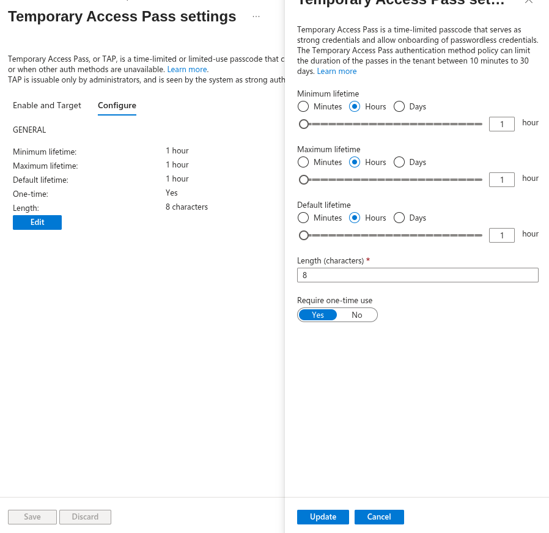
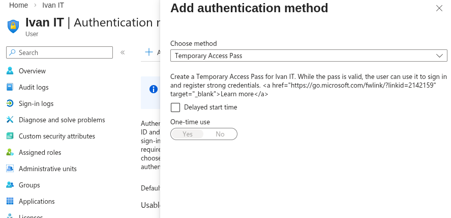
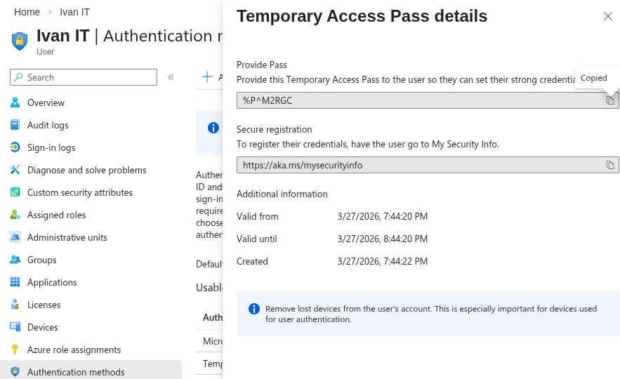
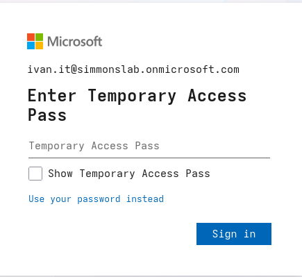
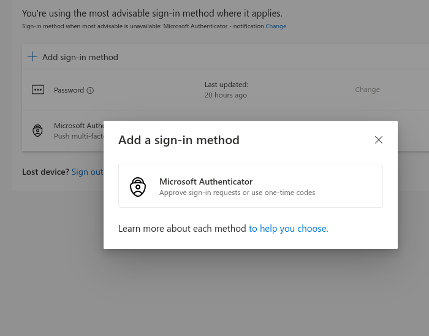

## 🧱 Phase 09.2 — Passwordless Onboarding with Temporary Access Pass (TAP)

### 🎯 Objective
Demonstrate how Temporary Access Pass (TAP) enables secure onboarding and prevents lockouts when implementing MFA and passwordless authentication in Microsoft Entra ID.

---

### 🔧 Scenario

In the previous lab, enforcing MFA/passwordless too early caused:

- MFA registration loop  
- “Sign-in couldn’t be completed” error  
- No valid authentication path  

This lab introduces TAP to solve that problem by providing a secure bootstrap method.

---

## 🧪 Step 1 — Enable Temporary Access Pass

Navigated to:

Entra → Protection → Authentication methods → Policies → Temporary Access Pass

Configured:

- Lifetime: 1 hour  
- One-time use: Yes  

### 📸 Screenshot — TAP Settings

---

## 🧪 Step 2 — Create Temporary Access Pass for User

Navigated to:

User → Ivan IT → Authentication methods

Added:

Temporary Access Pass

Generated code:

%P^M2RGC

### 📸 Screenshot — Add TAP Method

### 📸 Screenshot — TAP Details

---

## 🧪 Step 3 — Sign In Using TAP

Opened an incognito browser and signed in using:

`ivan.it@simmonslab.onmicrosoft.com`

Selected:

Sign-in options → Temporary Access Pass

### 📸 Screenshot — TAP Login Screen

---

### 🧠 Observed Behavior

- No password required  
- User successfully authenticated  
- Redirected to Security Info  

---

## 🧪 Step 4 — Register Authentication Method

User was prompted to register a method:

- Microsoft Authenticator  

### 📸 Screenshot — Add Sign-in Method

---

### 🧠 Outcome

- Authenticator registered successfully  
- User now has a valid authentication method  
- MFA can now be enforced without failure  

---

## 🧪 Step 5 — Validate Normal Login Flow

Performed standard login:

- Entered password  
- Prompted for MFA  
- Approved via Authenticator  

Result:

✔ Successful login  
✔ Conditional Access satisfied  
✔ No errors  

---

## 🧠 Key Learning

Temporary Access Pass solves a critical identity problem:

> How does a user authenticate if they have no valid authentication method yet?

---

### Before TAP

Require MFA / Passwordless
↓
No method registered
↓
Authentication loop ❌

---

### After TAP

TAP login ✔
↓
Register method ✔
↓
MFA works ✔
↓
Secure authentication flow ✔

---

## 🔥 Real-World Insight

TAP is used in enterprise environments for:

- New user onboarding  
- Passwordless rollout  
- MFA recovery scenarios  
- Secure account bootstrap  

---

## 💡 Outcome

This lab successfully demonstrated:
