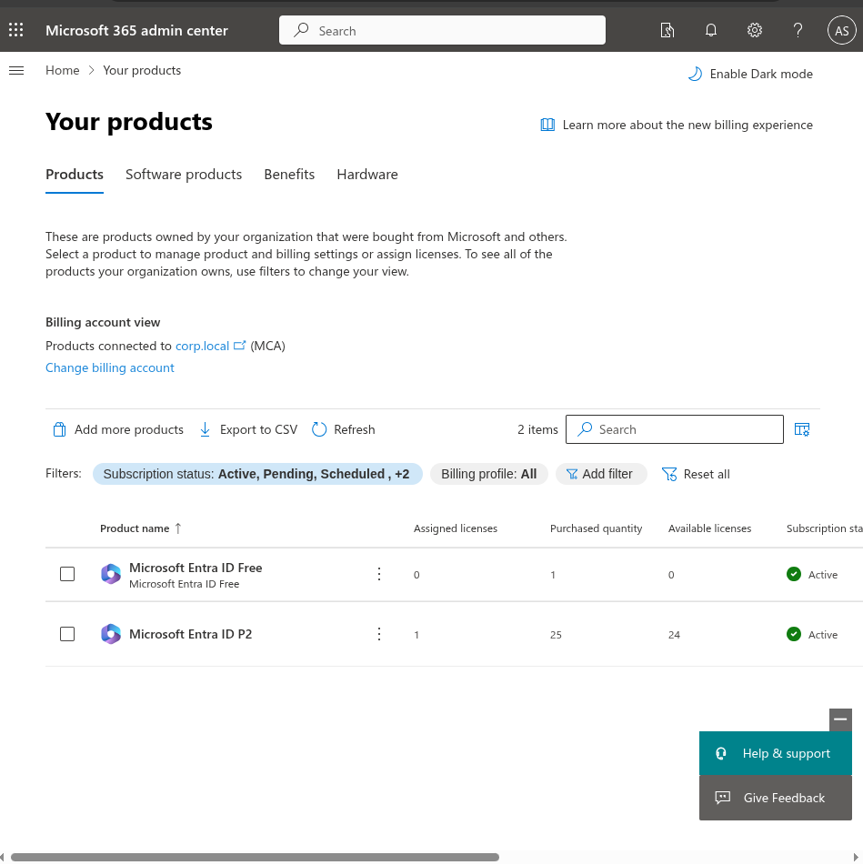
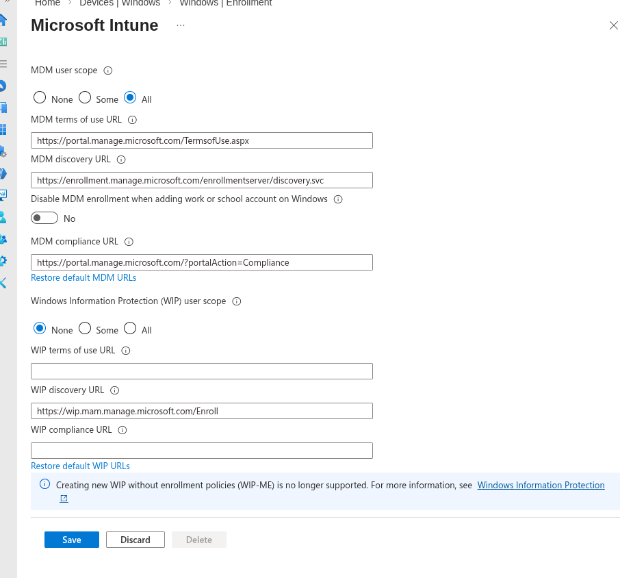
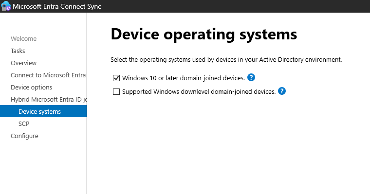
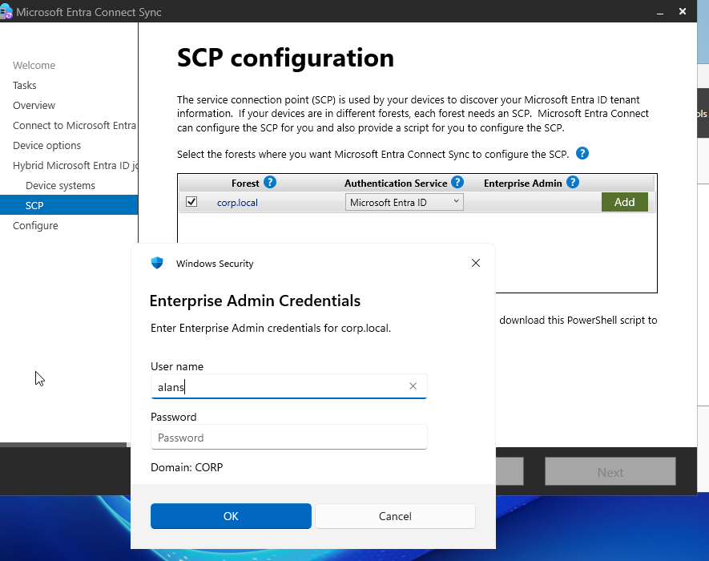
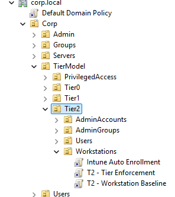
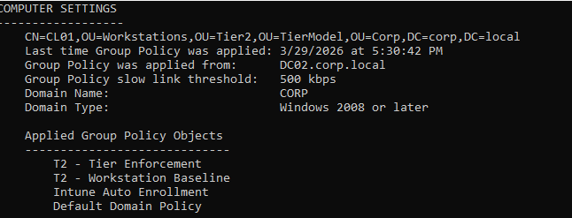
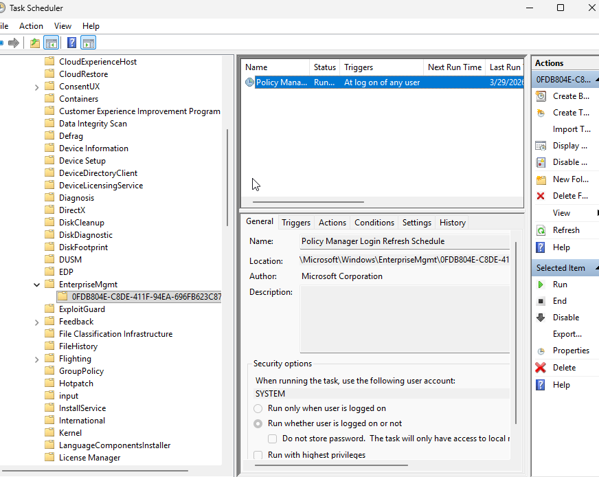
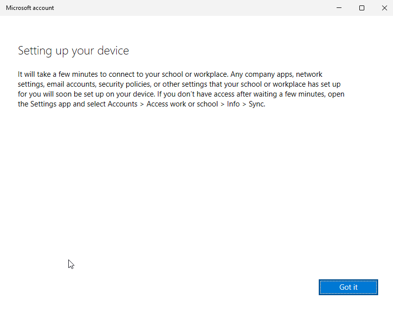
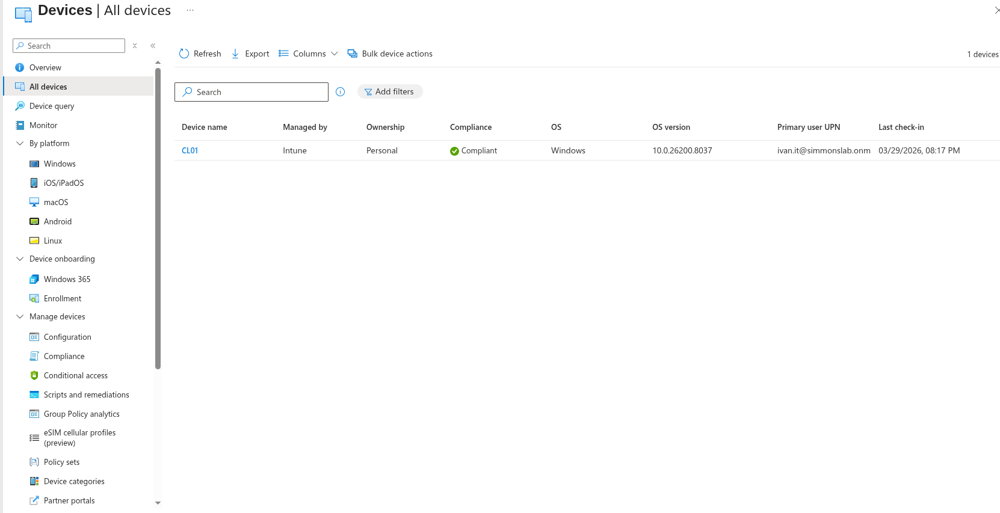

## 🧱 Phase 11 — Hybrid Device Join + Intune Enrollment (Real Troubleshooting Lab)

---

## 🎯 Objective

Successfully enroll a domain-joined Windows device into Microsoft Intune using:

- Hybrid Microsoft Entra ID Join
- Automatic MDM enrollment
- Group Policy
- Proper licensing + tenant configuration

---

## 🧪 Lab Environment

- Domain: `corp.local`
- Tenant: `simmonslab.onmicrosoft.com`
- Device: `CL01`
- User: `ivan.it@simmonslab.onmicrosoft.com`

---

# 🧪 Step 1 — Licensing + Intune Activation

Initially, Intune was not working correctly.

### 📸 Screenshot — Licenses Assigned

### 🧠 Issue

- Intune backend not initialized
- Service principal issues
- Access denied errors

### 🔧 Fix

- Assigned **Enterprise Mobility + Security E5**
- Waited for backend provisioning

---

# 🧪 Step 2 — Intune MDM Scope

Configured automatic enrollment:

### 📸 Screenshot — MDM Scope

- **MDM user scope = All**

---

# 🧪 Step 3 — Azure AD Connect (Hybrid Join)

Configured hybrid join:

### 📸 Screenshot — Device OS Selection

### 📸 Screenshot — SCP Configuration

### 📸 Screenshot — AD Credentials

---

# 🧪 Step 4 — GPO for Auto Enrollment

Created and linked:

- **Intune Auto Enrollment GPO**

### 📸 Screenshot — OU + GPO Link

### 📸 Screenshot — GPO Applied

---

# 🧪 Step 5 — Task Scheduler Verification

Initially missing → later appeared:

### 📸 Screenshot — EnterpriseMgmt Task

### 🧠 Meaning

This confirms:

✔ GPO applied  
✔ MDM enrollment triggered  

---

# 🧪 Step 6 — Enrollment Issues

Encountered multiple real-world errors:

### 📸 Screenshot — Already Managed Error

### 📸 Screenshot — Device Setup Screen

### 🧠 Issues Encountered

- Device already managed
- Duplicate device objects
- No Intune device showing
- Stale registration state
- Wrong user context
- MDM policy failing

---

# 🧪 Step 7 — Cleanup + Re-enrollment

Actions taken:

- Removed stale Entra device objects
- Cleared local enrollment state
- Re-logged with correct user
- Forced re-enrollment

---

# 🧪 Step 8 — Final Success

### 📸 Screenshot — Intune Device View

✔ Device shows in Intune  
✔ Managed by Intune  
✔ Compliant  

---

# 🧠 Key Learning

Hybrid identity ≠ device management

You need ALL of this aligned:

- Licensing ✔
- Intune activation ✔
- MDM scope ✔
- Azure AD Connect (hybrid join) ✔
- SCP ✔
- GPO ✔
- Correct OU ✔
- Correct user context ✔
- Cleanup of stale objects ✔

---

# 🔥 Real-World Insight

This was not a “click next” lab.

This was:

👉 identity + device + policy + licensing troubleshooting  
👉 exactly what happens in real environments  

---

# 💡 Outcome

Successfully built:

- Hybrid joined device
- Intune-managed endpoint
- Compliant device
- Foundation for Conditional Access

---

# 🚀 Next Steps

- Require compliant device in Conditional Access
- Deploy compliance policies
- Add BitLocker enforcement
- Test device-based access control
