# 🔐 14.0 — Entra Kerberos Cloud Trust Lab

## 🎯 Objective

Build and validate Microsoft Entra Kerberos Cloud Trust in a hybrid identity environment and analyze authentication behavior under different conditions.

---

## 🧱 Environment

### On-Prem Infrastructure

* Domain: corp.local
* DC01 (Core)
* DC02 (GUI)
* FS01 (File Server)
* SYNC01 (Azure AD Connect)

### Cloud

* Microsoft Entra ID (simmonslab.onmicrosoft.com)

### Client

* CL01 (Windows 11, Hybrid Joined)

---

# ⚙️ Phase 1 — Baseline Validation

## Hybrid Join Status

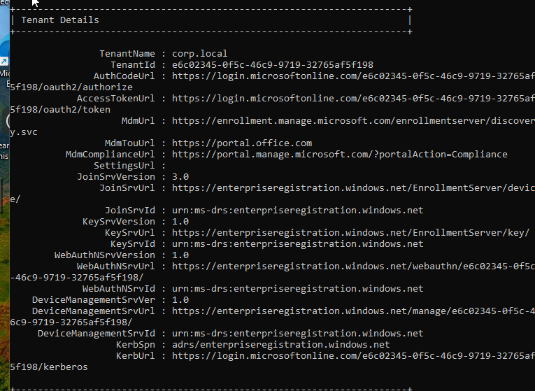

✔ AzureAdJoined: YES
✔ DomainJoined: YES

---

## Device Registration Details

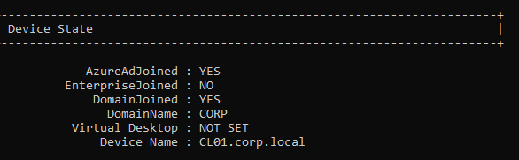

✔ DeviceAuthStatus: SUCCESS
✔ Entra endpoints present

---

## Domain Controller Discovery

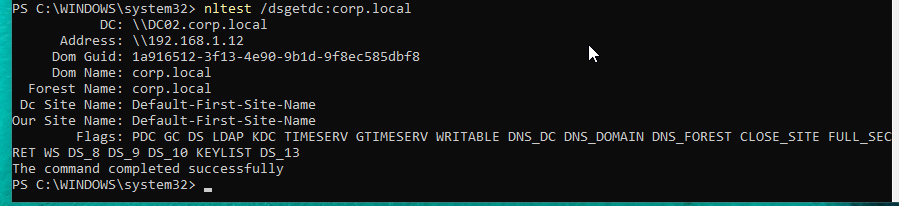

✔ DC02 discovered
✔ DNS + AD working

---

# ⚙️ Phase 2 — Module Installation & Setup

## Module Installation

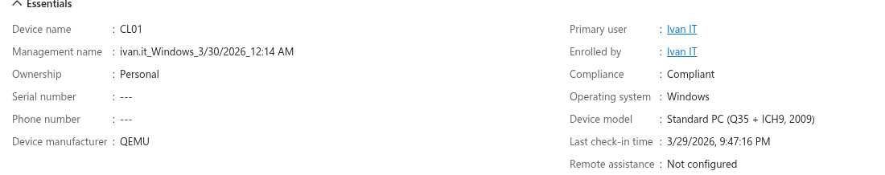

✔ AzureADHybridAuthenticationManagement installed

---

## Module Path / Environment

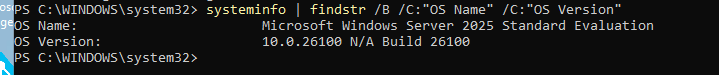

✔ Module located in user PowerShell path

---

## Sync Validation

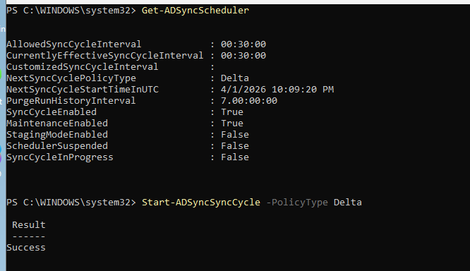

✔ Sync cycle active
✔ Manual sync triggered successfully

---

# ⚠️ Initial Issues Encountered

## Invalid UPN Error

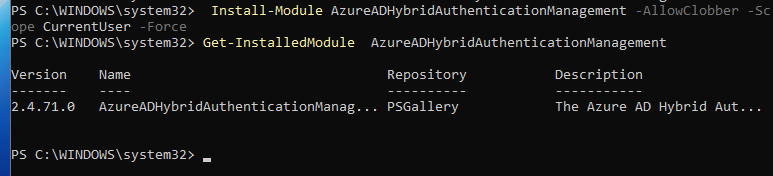

❌ ERR_INVALID_UPN
👉 Caused by incorrect credential format

---

## Authentication Prompt Loop

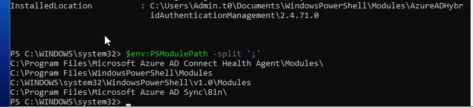

❌ Infinite sign-in loop
👉 Caused by legacy WS-Trust auth path

---

## Domain Credential Prompt

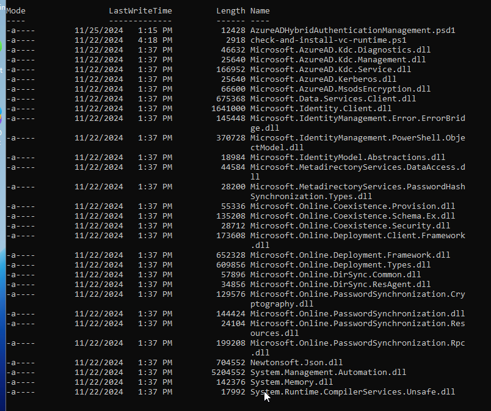

👉 Mixed credential contexts (cloud vs domain)

---

# 🔐 Role Activation (PIM)

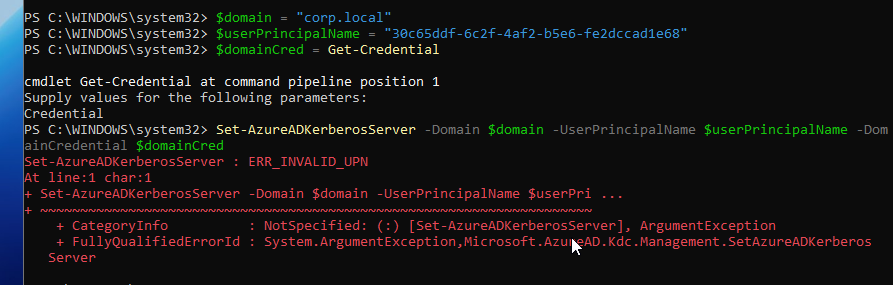

✔ Hybrid Identity Administrator activated

---

# ⚙️ FIX — Modern Authentication

## Connect-AzureAD

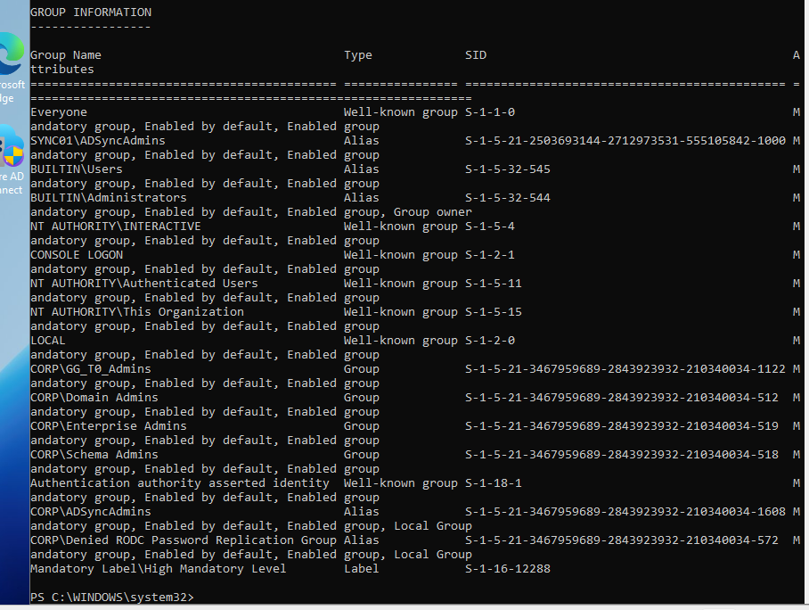

✔ Modern authentication session established
✔ Avoided WS-Trust issues

---

# 🚀 Kerberos Trust Configuration

## Successful Setup

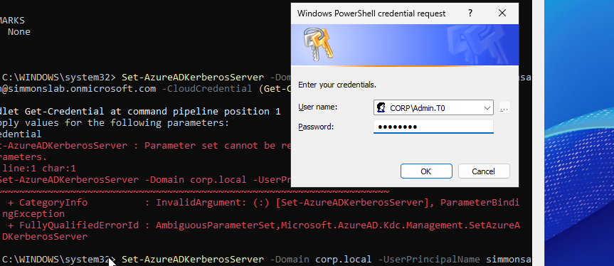

✔ Set-AzureADKerberosServer completed

---

## Verification

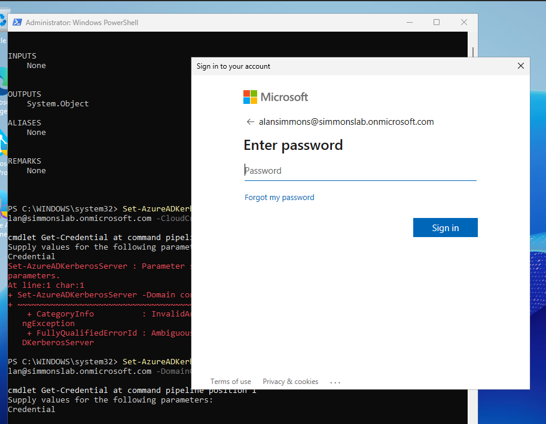

### Key Output

```
UserAccount     : CN=krbtgt_AzureAD,CN=Users,DC=corp,DC=local
ComputerAccount : CN=AzureADKerberos,OU=Domain Controllers,DC=corp,DC=local
CloudTrustDisplay : Microsoft.AzureAD.Kdc.Service.TrustDisplay
```

✔ Cloud Kerberos Trust established
✔ Keys synchronized between AD and Entra

---

# 🧪 Phase 3 — Authentication Testing

## Kerberos Tickets (Normal Operation)

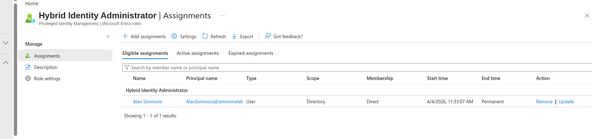

✔ krbtgt ticket present
✔ DC issuing tickets

---

## Test — DC Offline (Partial Failure)

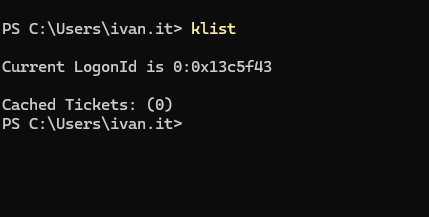

❌ No Kerberos tickets after purge
❌ No DC available

---

## SMB Access Attempt

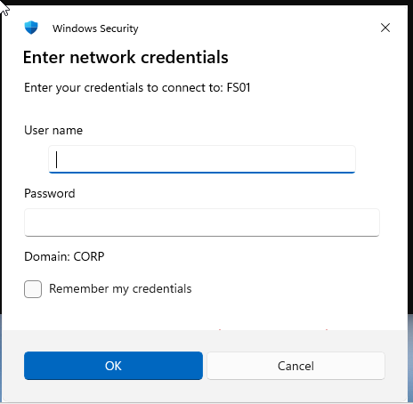

❌ Kerberos SSO failed
👉 Fallback to credential prompt

---

# 🧠 Key Findings

## 🔑 1. Kerberos Requires Domain Controllers

* Domain logon requires DC
* Kerberos validation requires DC
* No DC = no ticket issuance

---

## 🔁 2. Ticket-Based Authentication

| Condition        | Result             |
| ---------------- | ------------------ |
| Valid TGT exists | ✅ Access continues |
| TGT purged       | ❌ Access fails     |
| DC available     | ✅ Normal operation |

---

## ☁️ 3. Cloud Kerberos Scope

Cloud Kerberos Trust:

✔ Enables cloud-integrated authentication
✔ Supports hybrid identity scenarios

BUT:

❌ Does NOT replace domain controllers
❌ Does NOT allow SMB auth without DC
❌ Does NOT replace Kerberos for logon

---

# 💥 Conclusion

This lab demonstrated that Microsoft Entra Kerberos Cloud Trust enhances hybrid identity but does not eliminate dependency on domain controllers for traditional authentication.

---

# 🚀 Skills Demonstrated

* Active Directory (AD DS)
* Microsoft Entra ID
* Hybrid Identity Architecture
* Kerberos Authentication
* Authentication Troubleshooting
* PowerShell (AzureAD / Hybrid Modules)
* Real-world identity failure analysis

---

