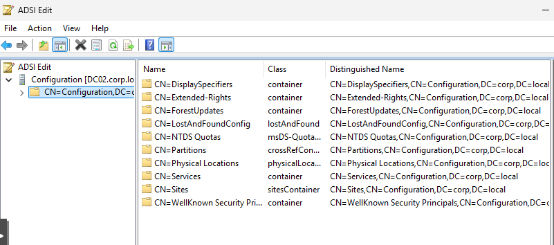
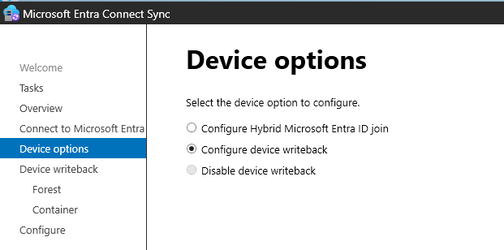
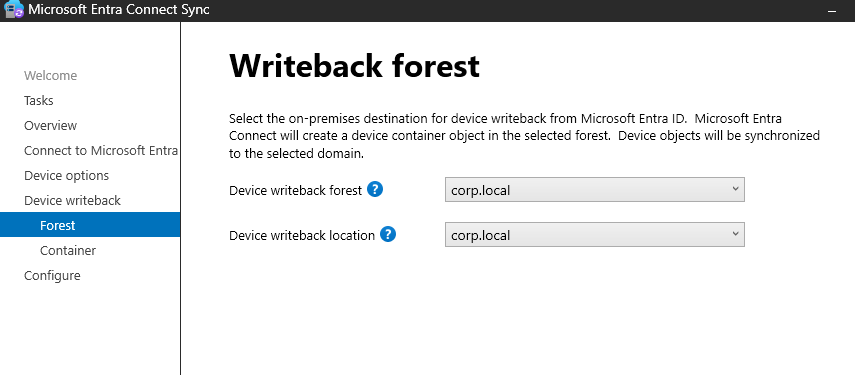
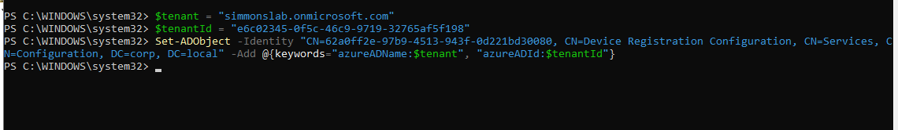

# 15.0 — SCP Behavior, Device Writeback, and Hybrid Join Validation

## Objective
Understand how the Service Connection Point (SCP), device writeback, and Microsoft Entra hybrid join interact — and validate what actually matters using real lab observations.

---

## Device State Validation (CL01)

Even before fixing SCP, the device was already in a valid hybrid state:

- AzureAdJoined: YES
- DomainJoined: YES
- EnterpriseJoined: NO

---

## Tenant / Registration Details

`dsregcmd /status` confirmed that Entra endpoints were still present and functional:

.png)

This showed:
- AuthCodeUrl
- AccessTokenUrl
- JoinSrvUrl
- KerbUrl

👉 This proves the device already had a working trust relationship.

---

## Entra Connect — SCP Configuration Step

During configuration, Entra Connect clearly states it will configure SCP:

.png)

---

## Device Writeback Configuration

Device writeback was enabled to simulate a more complete enterprise setup:

---

## What Entra Connect Configures

During setup, the following actions were performed:

- Creates device registration containers
- Enables device writeback
- Configures synchronization
- Updates connectors

---

## ADSI Edit — SCP Location

Navigated to:

CN=Configuration
└── CN=Services
└── CN=Device Registration Configuration

---

## SCP Object Observation

The SCP object existed, but initially lacked expected Azure-related attributes:

.png)

👉 No visible `keywords` or Azure-specific values.

---

## Manual SCP Attribute Injection

To simulate proper SCP population, attributes were manually added:

.png)

