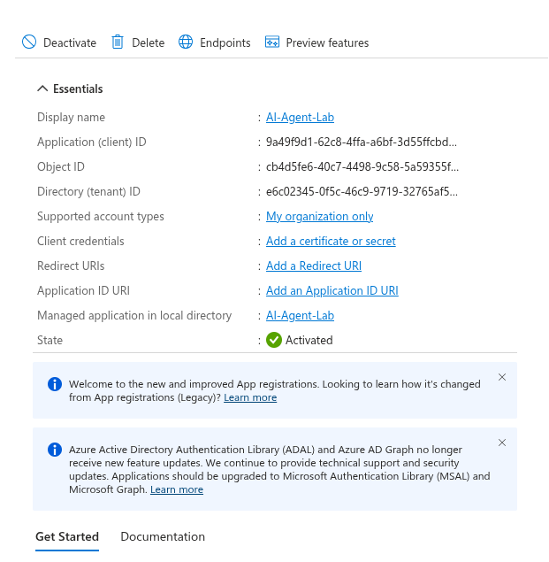
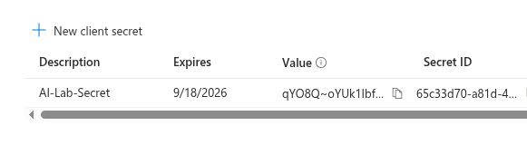

# Implementation Steps

## Step 1 — Create AI Identity
- Microsoft Entra ID → App registrations → New registration
- Name: AI-Agent-Lab



---

## Step 2 — Verify Service Principal
- Enterprise Applications → AI-Agent-Lab

---

## Step 3 — Define Resource (Conceptual)
AI-Lab-File-API:
- Read-only access

---

## Step 4 — Define Permissions (Least Privilege)

Allowed:
- Read files
- List files

Denied:
- Write
- Delete
- Admin access

---

## Step 5 — Create Client Secret
- Certificates & secrets → New client secret



---

## Step 6 — Authenticate (OAuth Client Credentials)

```bash
curl -X POST https://login.microsoftonline.com/<tenant-id>/oauth2/v2.0/token \
-H "Content-Type: application/x-www-form-urlencoded" \
-d "client_id=<client-id>" \
-d "client_secret=<secret>" \
-d "scope=https://graph.microsoft.com/.default" \
-d "grant_type=client_credentials" 
Step 7 — Token Received

This confirms successful authentication using the OAuth 2.0 client credentials flow.
